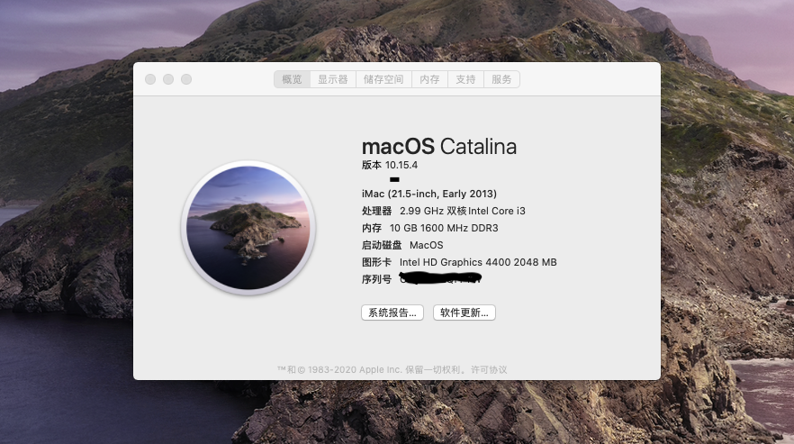

硬件型号：Lenovo ThinkCentre M4500q-N000

CPU型号：Intel i3-4150T

内存：DDR3 2GB+8GB

硬盘：悍将 360GB

显示器：AOC 2243W （DP转DVI连接）

声卡：ALC283(注入ID 66，44也可以用)

有线网卡：Intel i217v

USB蓝牙：胜为 UDC-324B（10.15.4暂不可用）

系统：Catalina 10.15.4（从黑果小兵网站下载10.15.2，自动更新至10.15.4）

说明：该clover可使有线网络、集成显卡(需打补丁到2048M，否则有花屏情况)正常，声卡只可使机体自带的小喇叭正常，耳机电流声略大。
 在升级10.15.4时，会卡在安装界面还有10分种时不动，然后强制关机，开机后登录界面背景白屏，刷新缓存重启后正常，但usb蓝牙不可用，还是更换dw1560网卡吧。
